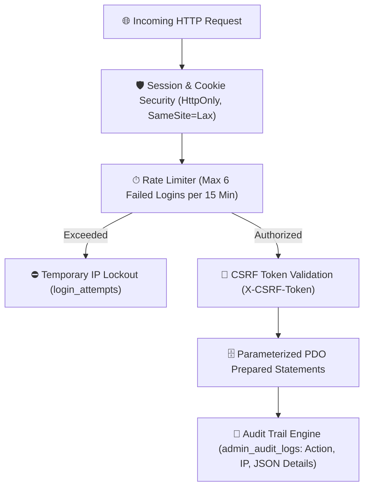
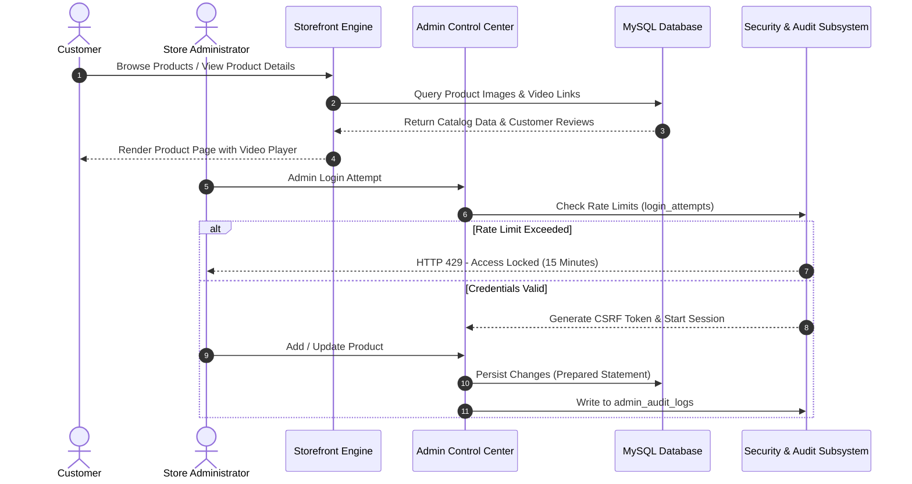
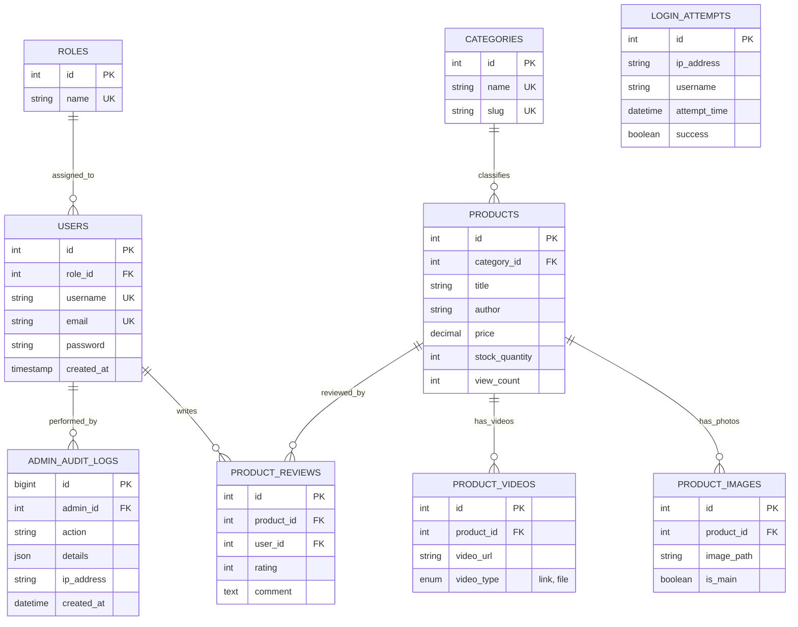

# Salah Library & Stationery E-Commerce Platform (متجر ومكتبة صلاح)

<p align="center">
  <strong>A Production-Ready Bookstore & Stationery E-Commerce Platform Featuring Multi-Media Showcases, Customer Reviews, and Hardened Administrative Audit Security</strong>
</p>

<p align="center">
  
  
  
  
  
  
</p>

---

## 📋 Table of Contents
- [Overview & Abstract](#-overview--abstract)
- [Key Features & Capabilities](#-key-features--capabilities)
- [Defensive Security Architecture](#-defensive-security-architecture)
- [System Architecture & Workflow](#-system-architecture--workflow)
- [Database Schema & ERD](#-database-schema--erd)
- [RESTful API Endpoints](#-restful-api-endpoints)
- [Project Directory Structure](#-project-directory-structure)
- [Installation & Local Deployment Guide](#-installation--local-deployment-guide)
- [Default Demo Credentials](#-default-demo-credentials)
- [Quality Assurance Checklist](#-quality-assurance-checklist)
- [License](#-license)

---

## 📚 Overview & Abstract

**Salah Library Platform** is a specialized e-commerce and retail inventory platform engineered for book publishers, educational stationery stores, and academic bookstores.

The system combines an intuitive, responsive customer storefront with an enterprise-grade administrative dashboard. Customers can search book catalogs, filter stationery by category, inspect products through multi-image galleries and embedded product video reviews, and submit verified feedback. 

On the administrative side, the platform enforces stringent cybersecurity safeguards—including automated brute-force IP throttling, tamper-evident audit logging (`admin_audit_logs`), and multi-layer file upload defense.

---

## ✨ Key Features & Capabilities

- **📖 Rich Multi-Media Product Showcases:**
  - Multi-image gallery with thumbnail selection and main image switching (`product_images`).
  - Native video preview support for book trailers and stationery demonstrations (`product_videos`).
- **⭐ Customer Feedback & Rating Engine:**
  - 5-star customer rating system with user reviews (`product_reviews`).
- **🔍 Fast Catalog Search & Filtering:**
  - Dynamic category navigation (Academic books, stationery, novels, etc.).
- **📊 Real-Time Analytics:**
  - Automated tracking of unique daily visitors and aggregate pageviews (`site_analytics`).
- **🎛 Full-Featured Admin CMS (`admin/`):**
  - Product management, category configuration, user role assignment (Admin, Editor, Customer), and password security.

---

## 🛡 Defensive Security Architecture

The platform was built with strict defensive controls to safeguard user data and administrative integrity:



1. **Automated Brute-Force Throttling:**
   - Any client IP exceeding 6 unsuccessful login attempts within a 15-minute window is temporarily blocked from authentication attempts (`login_attempts`).
2. **Administrative Audit Trail (`admin_audit_logs`):**
   - Every administrative modification (creating products, updating prices, modifying roles) records the operator ID, target resource, timestamp, and client IP in an immutable JSON audit ledger.
3. **Restricted Upload Security:**
   - The `uploads/` directory includes hardened `.htaccess` and `web.config` rules that explicitly prohibit the execution of server-side scripts (e.g., `.php`, `.phtml`, `.cgi`), neutralizing arbitrary file upload exploits.
4. **Zero Hardcoded Secrets:**
   - Database credentials read dynamically from environment variables (`DB_HOST`, `DB_USER`, `DB_PASS`) with clean local development fallbacks.

---

## 🔄 System Architecture & Workflow



---

## 🗄 Database Schema & ERD



---

## 📱 RESTful API Endpoints

The system provides lightweight JSON APIs in the `api/` directory:

| Endpoint | Method | Params | Description |
| :--- | :---: | :--- | :--- |
| `api/get_products.php` | `GET` | `?category_id={id}&page={n}` | Paginated catalog listing with main image and pricing. |
| `api/get_categories.php` | `GET` | - | Returns all active category departments. |
| `api/search.php` | `GET` | `?q={query}` | Instant live search for books, authors, and stationery items. |
| `api/get_stats.php` | `GET` | - | Aggregated traffic and daily pageview statistics. |
| `admin/api_handler.php` | `POST` | `action={action}` | Protected administrative backend handler (CSRF token required). |

---

## 📁 Project Directory Structure

```text
salah-library/
├── .gitignore                   # Excludes logs, environment configs, and temp files
├── LICENSE                      # MIT Open Source License
├── README.md                    # Comprehensive technical & academic documentation
├── QA_CHECKLIST.md              # Quality assurance & security test runbook
├── index.php                    # Storefront homepage & product catalog
├── product.php                  # Interactive single product details & video view
├── admin/                       # Administrative Control Center
│   ├── index.php                # Dashboard & real-time analytics
│   ├── products.php             # Product catalog manager
│   ├── add_product.php          # Product creation & media upload
│   ├── categories.php           # Category department management
│   ├── users.php                # Role administration
│   ├── login.php                # Hardened login with brute-force protection
│   └── api_handler.php          # Internal CSRF-verified administrative API
├── api/                         # Storefront RESTful JSON APIs
│   ├── db_config.php            # Active database connection (sanitized)
│   ├── db_config.example.php    # Clean environment configuration template
│   ├── get_products.php
│   ├── get_categories.php
│   └── search.php
├── database/                    # Unified SQL schema & seed records
│   └── schema.sql               # Complete 10-table relational schema
├── css/                         # Storefront styling
├── js/                          # Frontend scripts & dynamic interaction
├── uploads/                     # Product images & media storage (protected by .htaccess)
└── tests/                       # Automated API smoke tests
    └── api_smoke_test.php       # Verification test script
```

---

## 🚀 Installation & Local Deployment Guide

### Prerequisites
- **Web Server:** Apache (via XAMPP, WAMP, LAMP, or native Apache2).
- **PHP Version:** PHP 7.4 or 8.x (with `pdo`, `pdo_mysql`, `curl`, and `json` enabled).
- **Database:** MySQL 5.7+ or MariaDB 10.3+.

### Step-by-Step Installation

1. **Clone the Repository:**
   ```bash
   git clone https://github.com/your-username/salah-library.git
   cd salah-library
   ```

2. **Configure Database Connection:**
   Copy the example template to `api/db_config.php`:
   ```bash
   cp api/db_config.example.php api/db_config.php
   ```
   Set your local MySQL credentials:
   ```php
   $host     = 'localhost';
   $dbname   = 'LibraryStore';
   $username = 'root';
   $password = '';
   ```

3. **Import Database Schema:**
   ```bash
   mysql -u root -p LibraryStore < database/schema.sql
   ```
   *(Or import `database/schema.sql` via phpMyAdmin).*

4. **Launch Application:**
   Access the storefront via your browser:
   ```text
   http://localhost/salah-library/
   ```
   Access the Admin Portal:
   ```text
   http://localhost/salah-library/admin/login.php
   ```

---

## 🔑 Default Demo Credentials

| Role | Username | Password | Notes |
| :--- | :--- | :--- | :--- |
| **Store Administrator** | `admin` | `admin123` | Full access to dashboard, products, and audit logs. |

---

## 📄 License

This project is licensed under the **MIT License** - see the [LICENSE](LICENSE) file for details.
